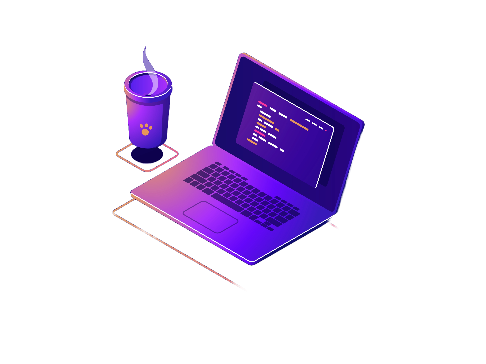

<h1>
    <a href="https://github.com/resorgatto">🔗</a> 
    Renato Sorgatto
</h1>

    Computer Science student (3rd semester), available for hiring. I'm eager to learn and grow professionally. I have experience with Java, Python, Django, RestFramework, HTML, CSS, and JavaScript, and I’m always looking to expand my knowledge.

<h3 align="left">Connect with me</h3>

<h3 align="left">GitHub Stats</h3>

 

  
Credits & Resources
 
 
  - Badges by <a href="https://shields.io/">shields.io</a> 
  - GitHub Stats by <a href="https://github.com/anuraghazra/github-readme-stats">anuraghazra</a> 
  - Developer vector by <a href="https://www.freepik.com/vectors/developer">storyset - www.freepik.com</a> (edited by author)
 
  
Made by <a href="https://github.com/resorgatto">resorgatto</a>.

